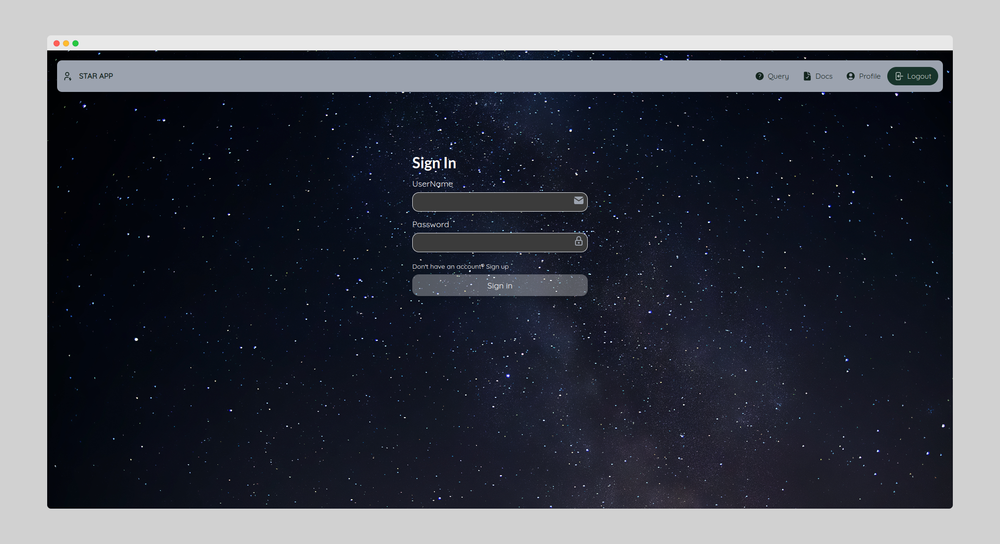
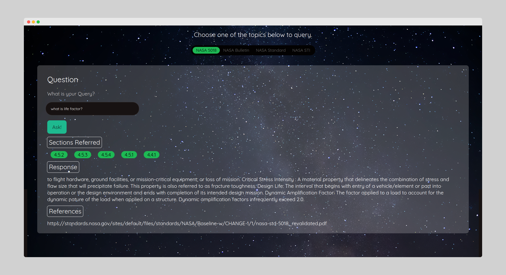
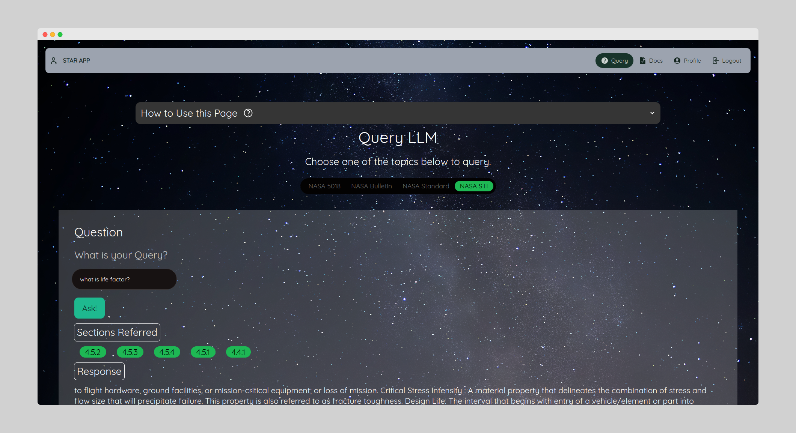
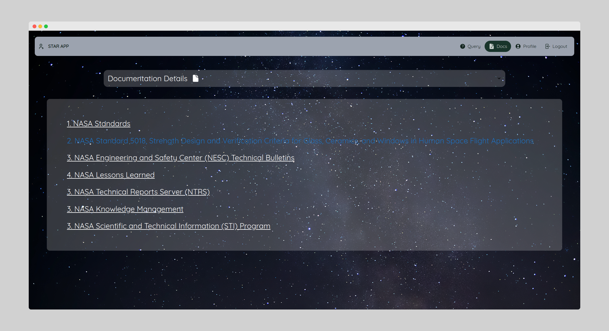

# STAR
App created for the NASA SpaceApps Challenge Hackathon in MITWPU Pune in 2023. Created as a Group project. 

# Group Members
1. Krishnaraj Thadesar
2. Sahaj Mishra
3. Saubhagya Singh
4. Yashwardhan Tekawade
5. Aaron Philip
6. Neeraj Verma

# Demo

# Screenshots

## Sign in

## Answers

## Query Page

## Documentation

# Features

1. Ability to ingest and convert documents into queryable information
2. Ability to text with the contents of the document 
3. Different document sources to choose from 
4. Ability to view previous queries of a user 
5. User authentication and security
6. Ability to view source documents directly 
7. Segmented answers that provide section,response,ref
8. Interactive UI
9. Dark mode

# Credits

Thanks to all the friends and team members to help us in making this project. 